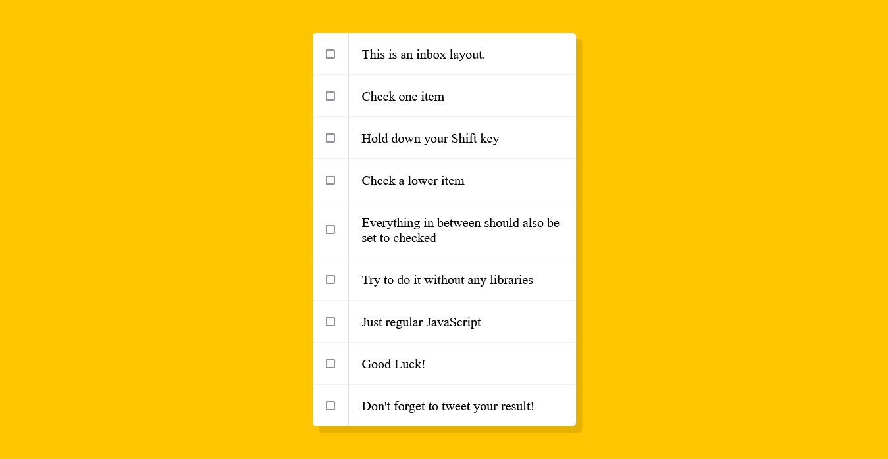

# JavaScript30 - Hold Shift to Check Multiple Checkboxes

This is a solution to a challenge from Wes Bos's [30 Day Vanilla JS Coding Challenge](https://javascript30.com/).

## Table of contents

- [Overview](#overview)
  - [The challenge](#the-challenge)
  - [Screenshot](#screenshot)
  - [Links](#links)
- [My process](#my-process)
  - [Built with](#built-with)
  - [What I learned](#what-i-learned)
  - [Continued development](#continued-development)

## Overview

### The challenge

Users should be able to check a checkbox, then hold down Shift key to check another checkbox and all the others inbetween them.

### Screenshot

### Links

- [View Code](https://github.com/elizerdim/hold-shift-and-check-boxes)
- [Live Preview](https://elizerdim.github.io/hold-shift-and-check-boxes/)

## My process

### Built with

- HTML
- CSS
- JavaScript

### What I learned

In this project, I had to think about how to apply my JavaScript knowledge to solve a problem. Even though this is a very basic functionality that we come across every day, I realized how these basic functionalities require critical thinking behind the scenes.

After watching the tutorial and trying to write the code from memory, I stumbled upon an alternative solution, so I decided to keep it. I also copied Wes Bos's solution and commented it out in the script.js file. 

### Continued development

I aim to solve most of the other challenges by Wes Bos in this program as they show how JavaScript is used in real world to add common functionalities.